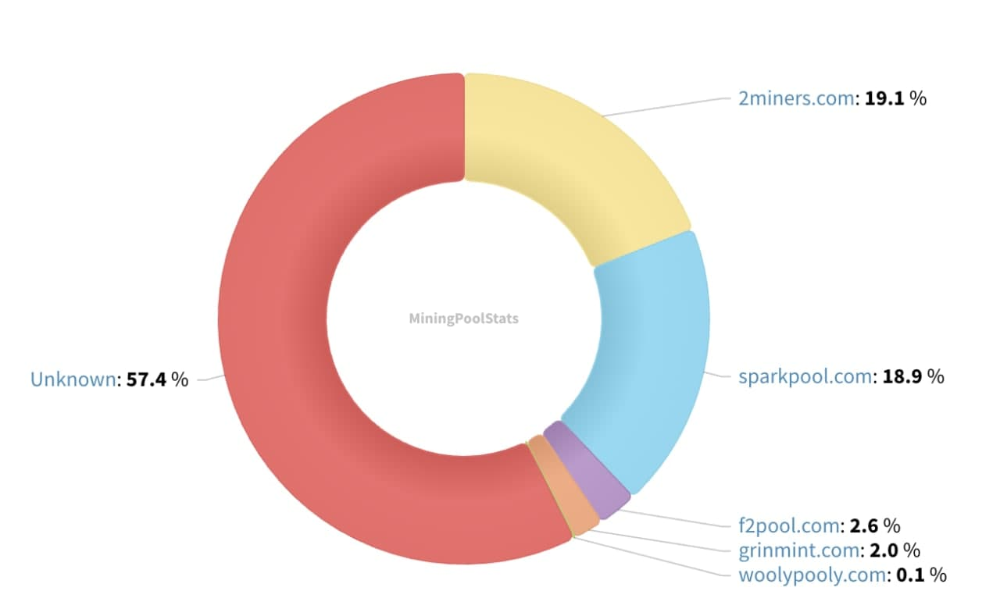
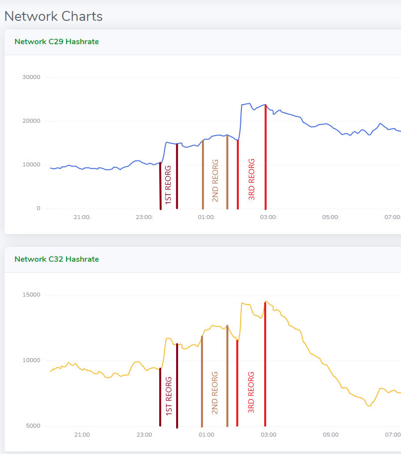
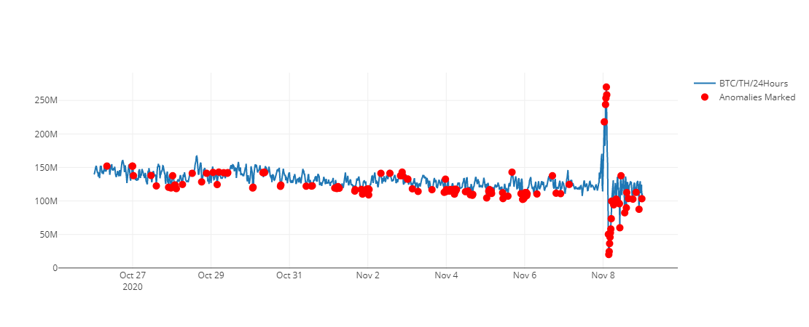

### Grin Hashrate increase
Grin network hashrate has increased considerably 3 times, between 22:40:42 and 02:27:17 UTC . This coincides with the Nicehash rate doubling in this time with well over 50% of the network hashrate currently outside of known pools.

- Grin unknown miners and pools hashrate during the attack
 

- Grin C29z and C32 hashrate chart correlated approximately to REORGs times 
 

### Nicehash C32 rate doubling
In the data provided by [forkwartch.io](https://www.forkwatch.io/grincuckatoo32), we spot an anomaly in the Nicehash cost, seeing a huge spike during the attack, resulting in an abnormal average price of ~0.218 BTC/KGPS/DAY during the malicious hashrate increase, instead of the normal average price of ~0.13 BTC/KGPS/DAY.

 

### Details of the REORGs

[details="REORG attacks"]
REORG attack : A blockchain reorganization attack occurs when miners collaborate to remove previously confirmed blocks from the blockchain, by providing the network with a new blockchain of higher cumulative difficulty, achieved by having majority hashrate.
In order to achieve a successful double-spend along with a REORG attack, an entity needs to secretly mine a seperate fork of the chain with majority hashrate (graph rate), thus superceding the honest blockchain in difficulty (future orphaned and stale blocks). The attacker creates a transaction on each chain; On the honest chain, the transaction will be sent to the victim and will look legit, until the attacker propagates his secretly mined chain, the REORG chain, in which he self-spent that same transaction. The self-spend in the REORG chain will be considered legit by all honest nodes, following the 'most cumulative difficulty' rule. Usually, the attacker propagates the dishonest chain when the transaction has passed multiple confirmations. This attack aims to circumvent the multiple confirmations system required to deposit on an exchange. After having released the secretly mined chain, the attacker essentially gets back the funds originally sent to the victim in his wallet.
[/details]

Accordingly, to this net hashrate increase and nicehash rate doubling, it appears the entity successfully created large REORGs.
In these REORGs, we could have seen the same entity double-spending one transaction at each REORG, we could possibly assume from that activity an attempt to realize a double-spend attack on exchange. 

As results of this network activity, Grin-Nodes by [Grinnode.live](https://grinnode.live/) reported REORGs. These Grin-Nodes are part of the "Reorg Monitoring-System" run by [Grinnode.live Infrastructure ](https://github.com/MCM-Mike/grinnode.live#infrastructure-grinnodelive) :

##### 1st REORG

- Between the block _949474_ and _949510_ - **REORG depth of 27 blocks**:

	Start of the 1st REORG | End of the 1st REORG
	------------ | -------------
	[Block n°949474](https://grinexplorer.net/block/949474) | [Block n°949510](https://grinexplorer.net/block/949510)
     

	Malicious tx confirmed in REORG block| Malicious tx confirmed in orphaned block
	------------ | -------------
	[Confirmed in REORG Block n° 949493](https://grinscan.net/block/000261a48947f69bf38e4edf33b7efa18cd3ecd24a7a8699ec70ebe45e373768) | [Confirmed in orphaned Block n°949501](https://grinscan.net/block/0000ada472a31ed7b0054e16a565427e8ec8d36e8edae0f571c50c3bcab9ac51)
	[Output n°1](https://grinscan.net/block/000261a48947f69bf38e4edf33b7efa18cd3ecd24a7a8699ec70ebe45e373768#o0) | [Output n°1](https://grinscan.net/block/0000ada472a31ed7b0054e16a565427e8ec8d36e8edae0f571c50c3bcab9ac51#o0)
	[Output n°2](https://grinscan.net/block/000261a48947f69bf38e4edf33b7efa18cd3ecd24a7a8699ec70ebe45e373768#o1) | [Output n°2](https://grinscan.net/block/0000ada472a31ed7b0054e16a565427e8ec8d36e8edae0f571c50c3bcab9ac51#o1)
	[Attacker's Txs Kernel in REORG block](https://grinscan.net/block/000261a48947f69bf38e4edf33b7efa18cd3ecd24a7a8699ec70ebe45e373768k0) | [Attacker's Txs Kernel in orphaned block](https://grinscan.net/block/0000ada472a31ed7b0054e16a565427e8ec8d36e8edae0f571c50c3bcab9ac51#k0)

**Result of the 1st REORG is a transaction double spent after 10 confirmations.**

----

##### 2nd REORG

- Between the block _949636_ and _949678_ - **REORG depth of 43 blocks**:

	Start of the 2nd REORG | End of the 2nd REORG
	------------ | -------------
	[Block n°949636](https://grinexplorer.net/block/949636) | [Block n°949678](https://grinexplorer.net/block/949678)
      

	Malicious tx confirmed in REORG block| Malicious tx confirmed in orphaned block
	------------ | -------------
	[Confirmed in REORG Block n° 949664](https://grinscan.net/block/0000a70697eaabc770ee771eaf15c433dcda183555cc5fb6688f13c543d88106) | [Confirmed in orphaned Block n°949670](https://grinscan.net/block/0002027a030163d06dd9127b798c6fff17e19204f7e1ebd415313ca712810d81)
	[Output n°1](https://grinscan.net/block/0000a70697eaabc770ee771eaf15c433dcda183555cc5fb6688f13c543d88106#o0) | [Output n°1](https://grinscan.net/block/0002027a030163d06dd9127b798c6fff17e19204f7e1ebd415313ca712810d81#o0)
	[Output n°2](https://grinscan.net/block/0000a70697eaabc770ee771eaf15c433dcda183555cc5fb6688f13c543d88106#o1) | [Output n°2](https://grinscan.net/block/0002027a030163d06dd9127b798c6fff17e19204f7e1ebd415313ca712810d81#o1)
	[Attacker's Txs Kernel in REORG block](https://grinscan.net/block/0000a70697eaabc770ee771eaf15c433dcda183555cc5fb6688f13c543d88106#k0) | [Attacker's Txs Kernel in orphaned block](https://grinscan.net/block/0002027a030163d06dd9127b798c6fff17e19204f7e1ebd415313ca712810d81#k0)

**Result of the 2nd REORG is a transaction double spent after 9 confirmations.**

----

##### 3rd REORG

- Between the block _949715_ and _949737_ - **REORG depth of 23 blocks**:

	Start of the 3rd  REORG | End of the 3rd REORG
	------------ | -------------
	[Block n°949715](https://grinexplorer.net/block/949715) | [Block n°949737](https://grinexplorer.net/block/949737)
      

	Malicious tx confirmed in REORG block| Malicious tx confirmed in orphaned block
	------------ | -------------
	[Confirmed in REORG Block n° 949718](https://grinscan.net/block/0000a70697eaabc770ee771eaf15c433dcda183555cc5fb6688f13c543d88106) | [Confirmed in orphaned Block n°949720](https://grinscan.net/block/0001170468d147e75492d9b1dbf3c8bee3869fa88c4f33508b7ddda3be0f2464)
	[Output n°1](https://grinscan.net/block/00025b694866287b64b04f3e021a6800356b74313e8fee72f1788a1009fd11b5#o0) | [Output n°1](https://grinscan.net/block/0001170468d147e75492d9b1dbf3c8bee3869fa88c4f33508b7ddda3be0f2464#o3)
	[Output n°2](https://grinscan.net/block/00025b694866287b64b04f3e021a6800356b74313e8fee72f1788a1009fd11b5#o1) | [Output n°2](https://grinscan.net/block/0001170468d147e75492d9b1dbf3c8bee3869fa88c4f33508b7ddda3be0f2464#o4)
	[Attacker's Txs Kernel in REORG block](https://grinscan.net/block/0001170468d147e75492d9b1dbf3c8bee3869fa88c4f33508b7ddda3be0f2464#k0) | [Attacker's Txs Kernel in orphaned block](https://grinscan.net/block/0001170468d147e75492d9b1dbf3c8bee3869fa88c4f33508b7ddda3be0f2464#k3)

**Result of the 3rd REORG is a transaction double spent after 18 confirmations.**

### Honest Transaction in orphan blocks
Honest transactions sent and confirmed in an orphaned block during the REORG, have been confirmed back once the concerned REORG ended. Only the transactions made by the attacker were double-spent.
## Mitigations

### Higher confirmations required
The hashrate seems to now have stabilized at normal conditions. Community members detected the abnormalities and cautioned all exchanges and pools to increase the minimum required number of confirmations in light of this. As always, it is important to require high confirmations for large payments on any network.

### Community Vigilance
The community will continue to stay vigilant to detect these events and make best efforts to protect the Grin ecosystem. We suggest every users to run their own Grin node (Grin-Node, Grin++) whenever possible (short time, long-term, does not matter), make sure your port 3414 is open if you wish to have inbound connections and not only outbound.

### Miners
If you have the possibility, mine with GPU in your launch - break / over night / 15 min a day / during coffee break. You will help to make the Grin network safer.

### ASICs 
We wish to see as soon as possible C32 ASICs in public sales, in order to have less hashing power influence from Nicehash. ASICs would help the network getting safer and Nicehash useless for any malicious attempts.

## Contact
If you need to contact us: https://github.com/MCM-Mike/grinnode.live/blob/master/contact.md 

### Credits
This report was also written by `deeev` (Keybase) 

